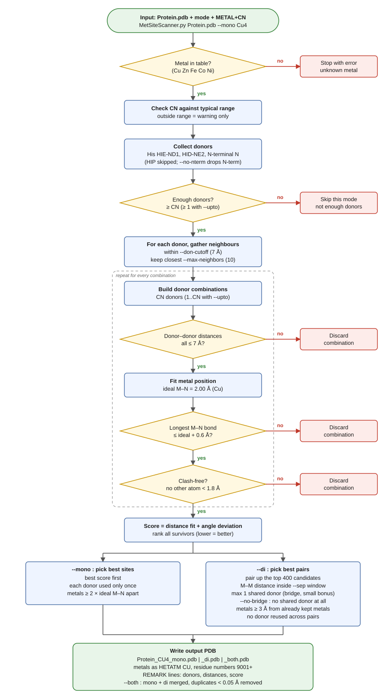

# MetSiteScanner

Finds possible **mono- or di-metal binding sites** in a peptide PDB, places the metal atoms, and writes a new PDB with them added. It is a geometry-based scanner, not an energy calculation. It tells you *where a metal could fit*, and you decide which sites are worth taking to QM.

## What it recognises

| Donors | Metals |
|---|---|
| His imidazole N (`HIE` → ND1, `HID` → NE2) | Cu, Zn, Fe, Co, Ni |
| N-terminal backbone amine | |

- `HIP` (doubly protonated His) has no free lone pair, so it is skipped.
- Cys, Asp, Glu and Met are **not** handled. This was written for a peptide that has none of them.
- Metal parameters (bond length, CN range, M–M window) live in the `METALS` table at the top of the script. Add a metal there and everything else works.

## Install

```bash
pip install numpy scipy
```

Python 3.8+.

## Quick start

```bash
python3 MetSiteScanner.py Protein.pdb --mono Cu4
```

`Cu4` means **metal + coordination number** (Cu with 4 donors). The script checks the CN against the usual range for that metal and warns you if it looks odd, but it still runs.

## Modes (pick exactly one)

| Mode | Finds | Example | Output |
|---|---|---|---|
| `--mono` | single-metal sites | `--mono Cu4` | `Protein_CU4_mono.pdb` |
| `--di` | metal-metal pairs | `--di Cu3` | `Protein_CU3_di.pdb` |
| `--both` | both, in one file | `--both Cu4` | `Protein_CU4_both.pdb` |

With `--both` the mono and di searches run independently, so di pairs are not guaranteed to reuse the mono sites. Metal positions that end up identical (closer than 0.05 Å) are merged, so you never get two metals on top of each other.

## Examples

```bash
# Accept sites with 1 to 4 donors, not only exactly 4
python3 MetSiteScanner.py Protein.pdb --mono Cu4 --upto

# Cu-Cu pairs 3.5 to 5.5 Å apart, no shared bridging donor
python3 MetSiteScanner.py Protein.pdb --di Cu3 --sep 3.5 5.5 --no-bridge

# Leave out the N-terminal amine as a donor
python3 MetSiteScanner.py Protein.pdb --mono Cu4 --no-nterm

# Print more ranked results on screen (the PDB always has all of them)
python3 MetSiteScanner.py Protein.pdb --mono Cu4 --top 10
```

## Options

| Option | Default | What it does |
|---|---|---|
| `--only` / `--upto` | `--only` | exactly CN donors / anywhere from 1 to CN |
| `--don-cutoff A` | 7.0 | max donor-donor distance for a site |
| `--max-dist A` | 0.6 | tolerance added to the ideal M–N length |
| `--clash A` | 1.8 | min distance from the metal to any non-donor atom |
| `--max-neighbors N` | 10 | donors considered around each seed (speed knob) |
| `--sep MIN MAX` | per metal | `--di` metal-metal window |
| `--no-bridge` | off | `--di`: forbid a shared donor between the two metals |
| `--pair-pool N` | 400 | `--di`: how many top candidates get paired |
| `--no-nterm` | off | do not use the N-terminal amine |
| `--dedup-tol A` | 0.05 | `--both`: merge metals closer than this |
| `--top N` | 5 | how many results to print (does not limit the PDB) |

## How it decides



1. **Check the request.** Unknown metal stops the run. An unusual CN only gives a warning.
2. **Collect donors** (His N and the N-terminus) and skip the mode if there are too few.
3. **Build candidate combinations** of donors that sit close together.
4. **Fit a metal position** to each combination at the ideal M–N distance.
5. **Throw out bad fits:** donors too far apart, a bond that is too long, or any other atom too close to the metal.
6. **Score** the survivors (distance fit plus deviation from the ideal donor-metal-donor angle). Lower is better.
7. **Pick the final sites.** Mono keeps the best ones with no donor reused. Di pairs candidates inside the separation window, allows at most one shared (bridging) donor, and again avoids reusing donors.

## Output

- A copy of your input PDB plus the new metals as `HETATM` records (atom name and residue name `CU`, residue numbers starting at **9001**).
- `REMARK` lines list each site's donors, M–N distances and score, so you can see what each metal is bound to.
- A ranked summary is printed on screen.

## Limitations

- Geometry only. Always inspect the sites in PyMOL or VMD before spending QM time on them.
- Only the donors listed above are recognised.
- Results depend on the input protonation states (`HIE` / `HID`), so check those first.

## Nothing found?

Try `--don-cutoff 9`, `--max-neighbors 15`, or for `--di` a wider `--sep` and a larger `--pair-pool`.
